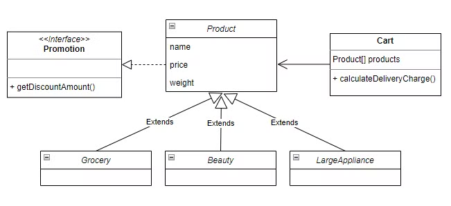

# Weekly Quiz
### 1. [인터페이스](#인터페이스)
### 2. [자료구조](#자료구조)
### 3. [JDBC](#JDBC)

<br><br>

# 인터페이스
## < 쇼핑몰 >

### 아래 그림과 같은 클래스와 인터페이스를 생성하고, 기능을 구현하세요.
쇼핑몰의 상품을 구현하고 해당 상품들의 배송비를 계산하는 문제입니다.

<br>

### 클래스 및 인터페이스 구조


| | |
|--------------------|--------------------------|
| **interfaceQuiz.Product**        | 상품 (부모 클래스)       |
| **interfaceQuiz.Grocery** <br> **interfaceQuiz.Beauty** <br>  **interfaceQuiz.LargeAppliance**   | 세부 상품들 (자식 클래스) |
| **interfaceQuiz.Cart**           | 장바구니  <br>  해당 문제에서는 배송비를 계산하는 메소드만 구현합니다. |
| **interfaceQuiz.Promotion**      | 쇼핑몰 이벤트 (인터페이스) <br> 해당 문제에서는 할인 금액을 리턴하는 메소드만 구현합니다. |

<br>

### 명세
쇼핑몰에서 판매하는 상품 종류는 아래 3가지이다.
- 식료품 (interfaceQuiz.Grocery)
- 화장품 (interfaceQuiz.Beauty)
- 대형가전 (interfaceQuiz.LargeAppliance)

<br>

각 상품들은 서로 다른 `무게`, `가격`, `할인금액` 속성을 가진다.

| 상품 | 무게 | 가격 | 할인금액 |
| --- | --- | --- | --- |
| interfaceQuiz.Grocery | 3 | 20000 | 2000 |
| interfaceQuiz.Beauty | 2 | 30000 | 10000 |
| interfaceQuiz.LargeAppliance | 5 | 50000 | 0 | 

<br>

배송비는 3가지 상품의 무게의 총합, 가격의 총합으로 계산한다.

<br>

무게에 따라 배송비가 책정된다.

| 무게 | 배송비 |
| --- | --- |
| 3미만 | 1000 |
| 3이상 10미만 | 5000 |
| 10이상 | 10000 |

<br>

무게로 책정된 배송비는 아래와 같이 상품 가격에 따라 추가 계산이 됩니다. **여기서의 가격은 할인 금액이 적용된 가격**이다.

| 가격 | 배송비 |
| --- | --- |
| 30000미만 | 배송비 변동 없음 |
| 30000이상 100000미만 | 배송비 1000 할인 |
| 100000이상 | 배송비 무료 |

<br><br>

# 자료구조
## < 연락처 정보 >

### 아래 그림과 같은 클래스를 생성하고, 기능을 구현하세요.
사용자가 연락처 정보를 추가하고 검색할 수 있는 프로그램을 만들어봅시다.

<br>

### 클래스 다이어그램


<br>

### `기능1. 메뉴 선택`
프로그램을 실행하면 아래의 메뉴 선택 화면이 출력됩니다.

```java
1. 비즈니스 연락처 추가
2. 개인 연락처 추가
3. 연락처 출력
4. 연락처 검색
5. 종료
메뉴를 선택해주세요: ↵
```

사용자는 1부터 5까지의 번호 중 하나를 입력할 수 있습니다. 사용자 입력을 받기위해 Scanner 클래스를 이용합니다.

<br>

### `기능2. 비즈니스 연락처 추가`
사용자가 1번 메뉴를 선택했을 때 아래의 화면이 출력됩니다.

```java
이름을 입력하세요: ↵
전화번호를 입력하세요: ↵
회사명을 입력하세요: ↵
```

사용자는 이름, 전화번호, 회사명을 입력할 수 있습니다. 사용자 입력이 완료되면 메뉴 선택 화면으로 돌아갑니다.

예시)

```java
이름을 입력하세요: 오르미↵
전화번호를 입력하세요: 010-1234-5678↵
회사명을 입력하세요: ESTsoft↵
```

<br>

### `기능3. 개인 연락처 추가`
사용자가 2번 메뉴를 선택했을 때 아래의 화면이 출력됩니다.

```java
이름을 입력하세요: ↵
전화번호를 입력하세요: ↵
관계를 입력하세요: ↵
```

사용자는 이름, 전화번호, 관계를 입력할 수 있습니다. 사용자 입력이 완료되면 메뉴 선택 화면으로 돌아갑니다.

예시)

```java
이름을 입력하세요: 오름이↵
전화번호를 입력하세요: 010-8765-4321↵
관계를 입력하세요: 친구↵
```

<br>

### `기능4. 연락처 출력`
사용자가 3번 메뉴를 선택했을 때 현재까지 추가한 모든 연락처를 출력합니다.

```java
이름: 오르미, 전화번호: 010-1234-5678, 회사명: ESTsoft
이름: 오름이, 전화번호: 010-8765-4321, 관계: 친구
```

비즈니스 연락처는 이름, 전화번호, 회사명을 출력합니다.

개인 연락처는 이름, 전화번호, 관계를 출력합니다.

<br>

단, 연락처 정보가 없는 경우 아래와 같은 화면을 출력합니다.

```java
연락처가 비어있습니다.
```

연락처 출력이 완료되면 메뉴 선택 화면으로 돌아갑니다.

<br>

### `기능5. 연락처 검색`
사용자가 4번 메뉴를 선택했을 때 이름을 입력할 수 있고, 연락처에 해당 이름이 있을 경우 출력합니다.

```java
검색할 이름을 입력하세요: ↵
```

이름이 일치하는 연락처가 있을 경우 화면에 출력합니다. 동일한 이름의 연락처가 여러 개 있다면 모두 출력해줍니다.

```java
검색할 이름을 입력하세요: 오르미↵
이름: 오르미, 전화번호: 010-1234-5678, 회사명: ESTsoft
```

```java
검색할 이름을 입력하세요: 오름이↵
이름: 오르미, 전화번호: 010-8765-4321, 관계: 친구
```

비즈니스 연락처는 이름, 전화번호, 회사명을 출력합니다.

개인 연락처는 이름, 전화번호, 관계를 출력합니다.

<br>

만약 일치하는 이름의 연락처가 없다면 아래 화면을 출력합니다.

```java
연락처를 찾을 수 없습니다.
```

연락처 검색이 완료되면 메뉴 선택 화면으로 돌아갑니다.

<br>

### `기능6. 종료`
사용자가 5번 메뉴를 선택했을 때 프로그램을 종료합니다.

<br>

```
※ 풀이를 위한 기본 지식

- 반복문
- String 클래스의 내부 메서드
- 콘솔 입출력(Scanner)
- ArrayList
```

<br><br>

# JDBC
## < 학생 정보 >

### 코드상에서 직접 SQL문을 작성해주세요.

- 학생 테이블에 있는 전체 학생들 중, 30대 학생들만 출력하기 (name, age, addres)

```java
※ hint
- java.sql.* 관련 클래스 import (=JDBC API 패키지 임포트)
- Mysql 연결 (Connection)
- DB 질의 응답을 위한 관련 객체 생성 (Statement 혹은 PreparedStatement)
- 질의결과를 저장 (ResultSet 객체)
- 객체 자원 닫기 (close() 혹은 다른 방법으로)
```

<br><br>